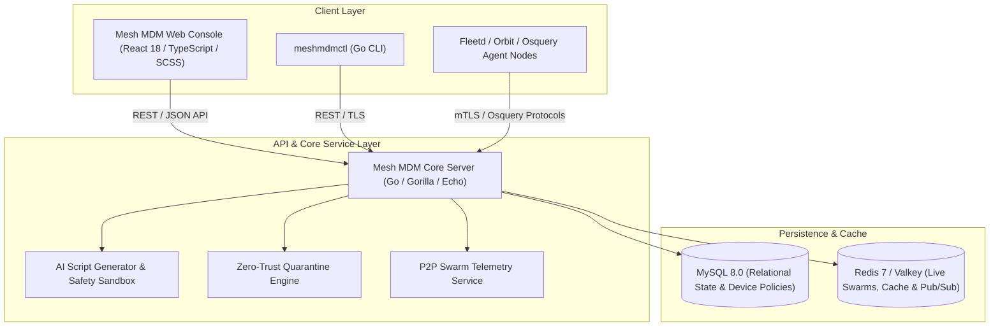

# Mesh MDM - Project Documentation & Architecture Guide

## 1. Executive Summary & Project Overview

**Mesh MDM** is an enterprise-grade, next-generation Mobile Device Management (MDM) and endpoint security platform. Forked and heavily customized from open-source device management architecture, Mesh MDM introduces autonomous AI scripting, zero-trust host isolation, peer-to-peer package distribution telemetry, and seamless multi-platform deployments across Windows, Linux, macOS, Docker, and Kubernetes.

---

## 2. Architecture & Tech Stack



### Core Technologies
- **Backend**: Go (Golang 1.23+), Gorilla Mux, WebSockets, `go-bindata` for embedded static assets.
- **Frontend**: React 18, TypeScript, SASS / CSS Modules, Lucide & Custom SVG icons.
- **Databases**: MySQL 8.0 / Percona Server, Redis 7 / Valkey.
- **Device Protocol**: Osquery-native extension protocol, NanoMDM engine (Apple MDM & Windows MDM / Wstep).
- **Packaging & CI**: WiX Toolset v3 (Windows MSI), Systemd (Linux), Docker Multi-Stage, Kubernetes K8s.

---

## 3. Key Custom Features & Innovations

### 3.1 AI-Assisted Script Generator & Safety Sandbox
- **Purpose**: Generates, validates, and refactors enterprise administration scripts (Bash, PowerShell) on-the-fly using generative intelligence.
- **Safety Heuristics**: Automatic code scanning for dangerous commands (`rm -rf /`, `diskpart`, `mkfs`, fork bombs), automatic privilege tagging (`Run as Root / SYSTEM`), and execution timeout limits.
- **Endpoint**: `POST /api/v1/fleet/scripts/ai`
- **Location**:
  - Backend: `server/service/scripts_ai.go`
  - Frontend: `frontend/pages/ManageControlsPage/Scripts/components/AIScriptModal/`

### 3.2 Zero-Trust Host Quarantine & Isolation
- **Purpose**: Instantly isolate compromised or non-compliant endpoints from the local network and corporate subnets while maintaining secure control-plane communication with Mesh MDM.
- **Mechanism**: Orchestrates firewall rules and network filtering via osquery/mdm extensions on Windows, macOS, and Linux endpoints.
- **Endpoints**:
  - `POST /api/v1/fleet/hosts/:id/quarantine`
  - `POST /api/v1/fleet/hosts/:id/unquarantine`
- **Location**:
  - Backend: `server/service/quarantine.go`
  - Frontend: `frontend/pages/hosts/details/HostDetailsPage.tsx`

### 3.3 Mesh P2P Package Telemetry
- **Purpose**: Distributed software and patch delivery using local peer-to-peer swarms, drastically reducing WAN bandwidth usage in enterprise networks.
- **Metrics Tracked**: Active swarm nodes, total chunk distribution, ISP bandwidth saved (%), peer health status.
- **Endpoint**: `GET /api/v1/fleet/mesh/p2p/stats`
- **Location**:
  - Backend: `server/service/p2p_stats.go`
  - Frontend: `frontend/pages/DashboardPage/cards/MeshP2PCard/`

### 3.4 Windows WiX MSI Packaging
- Standalone 64-bit installer generation using WiX Toolset.
- Bundles `meshmdm.exe`, `meshmdmctl.exe`, default configuration, and automatic Windows Service registration.
- Source: `tools/meshmdm.wxs`
- Target: `build/meshmdm-setup.msi`

---

## 4. API Reference Summary

| Method | Endpoint | Description | Auth Required |
| :--- | :--- | :--- | :--- |
| `POST` | `/api/v1/fleet/scripts/ai` | Generate and sanitize administration scripts with AI | Bearer Token |
| `POST` | `/api/v1/fleet/hosts/:id/quarantine` | Network-isolate a specific endpoint | Bearer Token (Admin) |
| `POST` | `/api/v1/fleet/hosts/:id/unquarantine` | Remove network isolation from an endpoint | Bearer Token (Admin) |
| `GET` | `/api/v1/fleet/mesh/p2p/stats` | Retrieve live P2P distribution telemetry | Bearer Token |
| `GET` | `/healthz` | Kubernetes & Docker health check probe | Public |

---

## 5. Deployment Options

### Option A: Kubernetes (Production & Cloud-Native)
A complete manifest is located at `k8s/meshmdm.yaml`.

```bash
# 1-Command Deployment to any Kubernetes cluster
kubectl apply -f https://raw.githubusercontent.com/meshingolala/meshmdm/main/k8s/meshmdm.yaml

# Verify deployment
kubectl get all -n meshmdm

# Port-forward to local machine
kubectl port-forward svc/meshmdm-service -n meshmdm 8080:8080
```

### Option B: Docker Compose (Instant Deployment)
Pre-configured in `docker-compose.yml`:

```bash
git clone https://github.com/meshingolala/meshmdm.git
cd meshmdm
docker compose up -d
```
Access the dashboard at `http://localhost:8080`.

### Option C: Linux Native Host (Systemd Service)
Automated script for Debian, Ubuntu, RHEL, CentOS:

```bash
git clone https://github.com/meshingolala/meshmdm.git
cd meshmdm
sudo chmod +x install-linux.sh
sudo ./install-linux.sh
sudo systemctl start meshmdm
```

### Option D: Windows Server / Desktop
- Run `build\meshmdm-setup.msi` for full automated installation as a Windows Service.
- Or run standalone in development mode:
  ```powershell
  .\build\meshmdm.exe serve --dev --dev_license --server_address=127.0.0.1:8080
  ```

---

## 6. Build & Development Guide

### Prerequisites
- **Go**: 1.23 or newer
- **Node.js**: 20+ & **Yarn**: 1.22+
- **MySQL Server**: 8.0+
- **Redis Server**: 6.0+

### Building the Frontend
```bash
cd frontend
yarn install
yarn build
```

### Embedding Assets & Compiling Backend
```powershell
# 1. Package static assets into Go source
go run github.com/kevinburke/go-bindata/go-bindata -pkg bindata -tags full -o server/bindata/generated.go frontend/templates/ assets/... server/mail/templates

# 2. Compile Mesh MDM server binary
$env:CGO_ENABLED=0
go build -tags full -o build/meshmdm.exe ./cmd/fleet
go build -tags full -o build/meshmdmctl.exe ./cmd/fleetctl
```

---

## 7. Version Control & Repository

- **GitHub Repository**: [https://github.com/meshingolala/meshmdm](https://github.com/meshingolala/meshmdm)
- **Default Branch**: `main`
